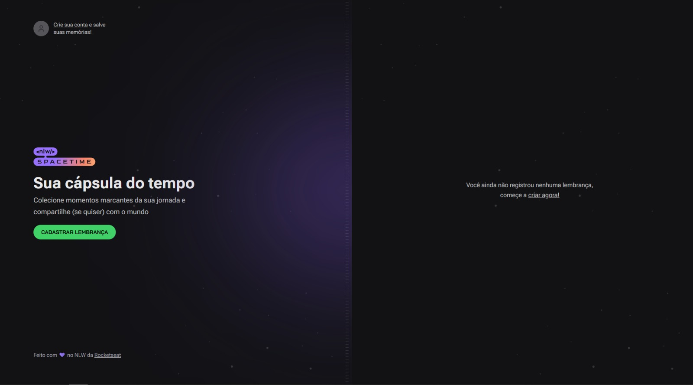
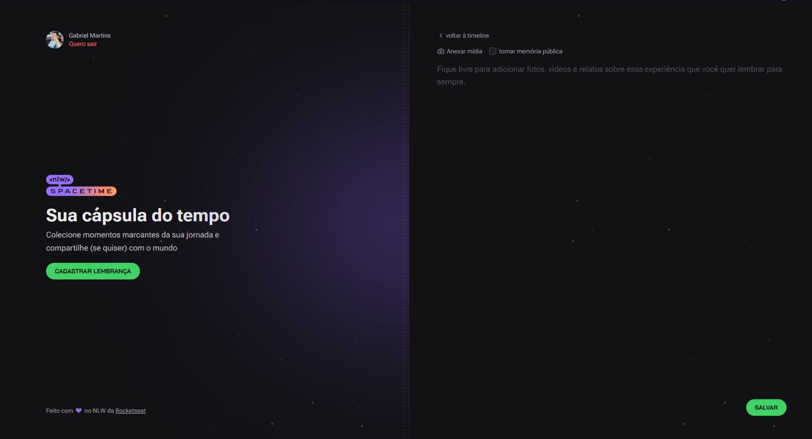
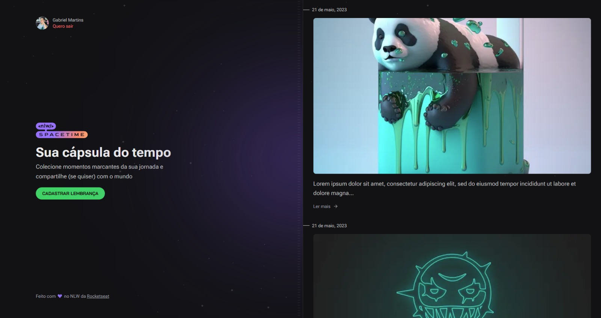
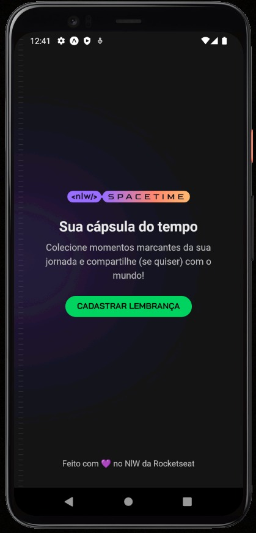
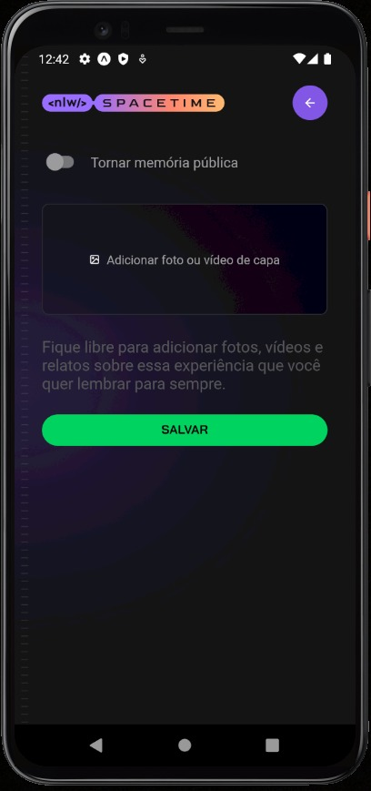
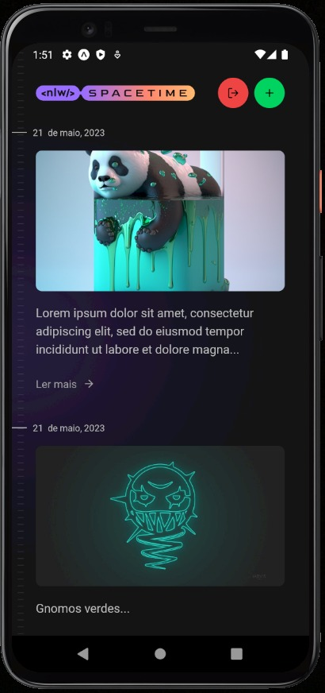

<h1 align='center'>NLW Spacetime</h1>

  

<h2 align='center'>💻 Projeto</h2>

  Aplicação Fullstack de recordação de memórias, onde o usuário poderá adicionar à uma timeline textos e fotos de acontecimentos marcantes da sua vida.

<h2 align='center'>⚙ Tecnologias </h2>

  

<h2 align='center'> WEB </h2>

  

  

  

<h2 align='center'> MOBILE </h2>

  
  
  

#### Obs
NLW Spacetime é um projeto desenvolvido no evento da Rocketseat. Durante o evento, tive a oportunidade de aprender muita coisa e com os conteudos mais atualizados do mercado com este projeto. É importante destacar que a totalidade dos créditos e méritos pela concepção e desenvolvimento do projeto pertence à Rocketseat e sua equipe.